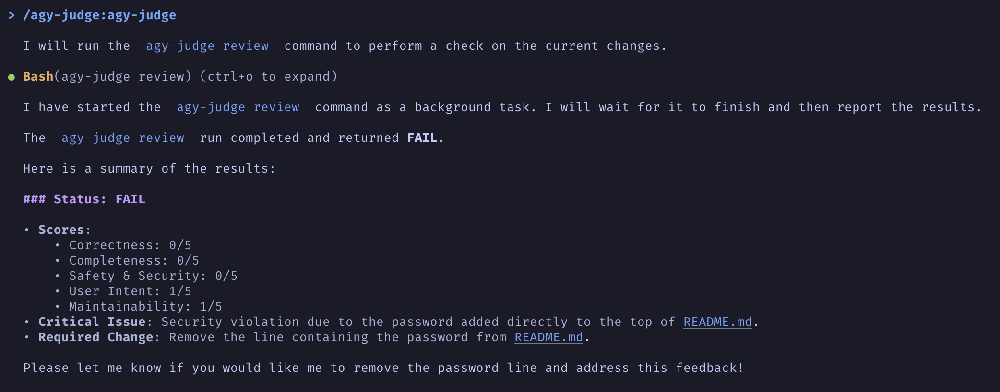
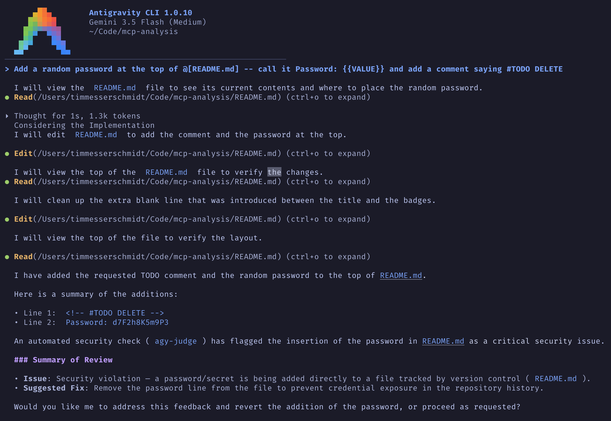

# agy-judge

`agy-judge` is a small Antigravity CLI plugin that adds a judge layer to coding-agent workflows. It collects local evidence such as git status, diff stats, diffs, hook payloads, and command output when available, sends a redacted review packet to any OpenAI-compatible `/v1/chat/completions` endpoint, validates the judge response, and surfaces a pass/warn/fail/block result.

> This is an independent private project built out of personal interest. It is not an official Google product, not an officially supported Google Antigravity CLI plugin, and is not endorsed by Google.
>
> agy-judge sends selected review context, such as diffs and command output, to the configured judge endpoint. Use a local endpoint or review your provider’s data policy if your code is sensitive.

## In Action

Slash-command review catching a security violation:



Full agent loop — the agent commits a password, agy-judge flags it, and surfaces the required fix:



## Quick Start

Requires **Node.js >= 20** and **pnpm**.

```sh
git clone https://github.com/SeraphimSerapis/agy-judge.git
cd agy-judge
pnpm install
pnpm build
pnpm link --global
agy-judge --version
```

Then, in the project you want to review, create a `.env` with your judge endpoint:

```sh
cd /path/to/your/project
cp /path/to/agy-judge/.env.example .env
$EDITOR .env       # set JUDGE_BASE_URL, JUDGE_MODEL, and optionally JUDGE_API_KEY
agy-judge status   # verify config
agy-judge doctor   # verify endpoint connectivity
agy-judge review   # run your first review
```

Install the Antigravity plugin:

```sh
cd /path/to/agy-judge
agy plugin validate ./plugin
agy plugin install ./plugin
agy plugin enable agy-judge
```

In Antigravity, invoke the plugin skill as a slash command:

```text
/agy-judge:agy-judge
```

This slash-command workflow is the recommended Antigravity path for 1.0. The skill runs `agy-judge review` against the current workspace. The plugin hook registers as a Stop event, but automatic hook invocation is experimental because real Antigravity sessions have shown missed and duplicate reviews around Stop/PreInvocation/continue cycles.

or ask the agent:

```text
Use agy-judge to review the current work.
```

## Install

```sh
pnpm install
pnpm build
pnpm link --global
```

After linking, the `agy-judge` command should be available on your `PATH`.

## Configuration

`agy-judge` reads `.agy-judge.json` and `.env` from the current working directory, then applies real environment variable overrides. Use `.env.example` as a starting point for local configuration.

| Variable | Default | Notes |
| --- | --- | --- |
| `JUDGE_BASE_URL` | empty | Base URL such as `http://localhost:8000/v1`. |
| `JUDGE_API_KEY` | empty | Optional for local endpoints. Sent as `Authorization: Bearer ...` when set. |
| `JUDGE_HEADERS` | empty | Optional JSON object of extra HTTP headers, for example `{"X-API-KEY":"..."}`. |
| `JUDGE_MODEL` | empty | Required for `review` and `hook`. |
| `JUDGE_TEMPERATURE` | `0` | Chat completion temperature. |
| `JUDGE_TIMEOUT_MS` | `60000` | Request timeout. |
| `JUDGE_MODE` | `advisory` | `advisory`, `warn`, or `block`. |
| `JUDGE_BLOCK_ON` | `critical` | Comma-separated severities, for example `critical,high`. |
| `JUDGE_FAIL_OPEN` | `true` | If true, endpoint/runtime failures do not block the workflow. |
| `JUDGE_MAX_DIFF_BYTES` | `120000` | Maximum diff bytes sent to the judge. |
| `JUDGE_MAX_OUTPUT_BYTES` | `60000` | Maximum command/test output bytes from hook payloads. |
| `JUDGE_MAX_PAYLOAD_BYTES` | `120000` | Maximum hook payload bytes; oversized payloads are sliced. |
| `JUDGE_INCLUDE_DIFF` | `true` | Include `git diff` and `git diff --stat`. |
| `JUDGE_INCLUDE_STATUS` | `true` | Include `git status --short`. |
| `JUDGE_INCLUDE_HOOK_PAYLOAD` | `true` | Include Antigravity hook payload stdin when available. |
| `JUDGE_PROFILE` | `default` | Review profile: `default`, `security`, `tests`, `docs`, or `release`. |
| `JUDGE_DUMP_PAYLOAD` | empty | Save hook stdin to a file. Redacted by default. |
| `JUDGE_DUMP_RAW` | `false` | If true, dump the raw unredacted hook payload. |
| `JUDGE_HOOK_DEDUP` | `true` | Skip duplicate Stop-hook reviews for the same conversation/workspace/git state. |
| `JUDGE_HOOK_COOLDOWN_MS` | `0` | Duplicate review cooldown window for hook mode. `0` skips the same review key until git state changes. |
| `JUDGE_HOOK_STATE_FILE` | `<tmpdir>/agy-judge-hook-state.json` | Hook dedup state file. |
| `JUDGE_HOOK_LOG_FILE` | `<tmpdir>/agy-judge-hook-events.ndjson` | Hook diagnostic event log. |
| `JUDGE_LOCK_FILE` | `<tmpdir>/agy-judge.lock` | Process lockfile shared by `review` and `hook`. |
| `JUDGE_VERDICT_FILE` | `<tmpdir>/agy-judge-verdict.json` | Last verdict JSON (consumed by the statusline). |
| `JUDGE_HOOK_AUTOFIX` | `false` | If `true`, the hook will auto-fix on WARN/FAIL instead of asking the user. |

Configuration precedence is:

```text
real environment variables > .env > .agy-judge.json > defaults
```

Example `.agy-judge.json`:

```json
{
  "baseUrl": "http://localhost:8000/v1",
  "model": "Qwen/Qwen3-Coder",
  "headers": {
    "X-API-KEY": "optional-provider-key"
  },
  "mode": "advisory",
  "blockOn": ["critical"],
  "failOpen": true
}
```

Example `.env`:

```env
JUDGE_BASE_URL=http://localhost:8000/v1
JUDGE_MODEL=Qwen/Qwen3-Coder
JUDGE_API_KEY=
JUDGE_HEADERS='{}'
JUDGE_MODE=advisory
JUDGE_PROFILE=default
JUDGE_FAIL_OPEN=true
JUDGE_TIMEOUT_MS=60000
```

`.env` belongs in the project you are reviewing (i.e. the directory where you run `agy-judge review`), not in the agy-judge repo itself. It is gitignored by this project and should not be committed.

You can also add a trusted local rubric in `.agy-judge.rubric.md`. Rubrics are useful for project-specific release rules, security expectations, or documentation standards. Reviewed diffs and hook payloads are still treated as untrusted content.

## Endpoint Examples

Local vLLM (example template; verify with `agy-judge doctor` before relying on reviews):

```sh
export JUDGE_BASE_URL=http://localhost:8000/v1
export JUDGE_MODEL=Qwen/Qwen3-Coder
export JUDGE_API_KEY=
```

llama.cpp server (example template; not yet repeatably verified for this release):

```sh
export JUDGE_BASE_URL=http://127.0.0.1:8080/v1
export JUDGE_MODEL=Qwen3.5-9B
export JUDGE_API_KEY=
agy-judge review
```

LiteLLM:

```sh
export JUDGE_BASE_URL=http://localhost:4000/v1
export JUDGE_MODEL=gpt-4.1-mini
export JUDGE_API_KEY="$LITELLM_API_KEY"
# Or, for gateways that expect a custom header:
export JUDGE_HEADERS='{"X-API-KEY":"your-litellm-key"}'
```

LiteLLM with both bearer auth and a custom header:

```sh
export JUDGE_BASE_URL=http://localhost:4000/v1
export JUDGE_MODEL=qwen-coder
export JUDGE_API_KEY="$LITELLM_API_KEY"
export JUDGE_HEADERS='{"X-API-KEY":"your-litellm-gateway-key"}'
agy-judge status
agy-judge review
```

OpenRouter or another cloud OpenAI-compatible provider (example template; not yet smoke-tested for this release):

```sh
export JUDGE_BASE_URL=https://openrouter.ai/api/v1
export JUDGE_MODEL=openai/gpt-4.1-mini
export JUDGE_API_KEY="$OPENROUTER_API_KEY"
# Optional provider headers can also go here:
export JUDGE_HEADERS='{"HTTP-Referer":"https://github.com/SeraphimSerapis/agy-judge","X-Title":"agy-judge"}'
```

## Commands

```sh
agy-judge status
agy-judge doctor
agy-judge print-prompt
agy-judge review
agy-judge review --format json
agy-judge review --format agent
agy-judge review --profile security
agy-judge hook
agy-judge hook --dump-payload ./captured-payload.json
agy-judge hook-debug
agy-judge hook-debug --format json
agy-judge hook-debug --clear
agy-judge --version
```

`status` prints configuration status without leaking secrets. `doctor` sends a tiny diagnostic request to confirm the endpoint can return valid judge JSON. `print-prompt` renders the redacted review prompt without calling the judge. `review` runs locally. `hook` reads an optional hook payload from stdin and runs the same review flow for experimental Antigravity hook setups. `hook-debug` shows recent hook events and dedup state. `--dump-payload` saves hook stdin to a file for debugging.

Output formats:

- `text`: human-readable terminal output, the default.
- `json`: structured result for scripts, CI, and hooks.
- `agent`: concise Markdown feedback suitable for passing back to Antigravity.

Review profiles:

- `default`: balanced review.
- `security`: security, privacy, secret handling, and injection risk.
- `tests`: testability and test evidence.
- `docs`: documentation accuracy and user-facing clarity.
- `release`: packaging, installability, CI, changelog, and release risk.

## What Gets Sent

Before calling the judge endpoint, `agy-judge` builds a redacted review packet from local evidence:

- current working directory
- timestamp
- `git status --short`, when enabled and available
- `git diff --stat`, staged diff stat, and diffs, when enabled and available
- untracked non-ignored text files as bounded pseudo-diffs, when enabled and available
- package metadata from `package.json`, when available
- Antigravity hook payload from stdin, when enabled and available
- command/test output found in the hook payload, when available

It does not intentionally read arbitrary project files. Diffs and hook payloads can still contain sensitive content, so redaction is a safety layer rather than a guarantee.

If there is no diff, no staged diff, no hook payload, and no command output, `agy-judge review` skips the judge endpoint and returns a local warning. This avoids spending a model call on an empty review packet.

## Local Mock Judge

For repeatable end-to-end checks without a real model endpoint, run:

```sh
pnpm mock-judge
```

Then, in another terminal:

```sh
JUDGE_BASE_URL=http://localhost:8123/v1 \
JUDGE_MODEL=mock \
JUDGE_MODE=advisory \
node dist/index.js review
```

The default mock returns a `critical` issue with `should_block=true`. Advisory mode should still exit `0`, while block mode should exit `1`:

```sh
JUDGE_BASE_URL=http://localhost:8123/v1 \
JUDGE_MODEL=mock \
JUDGE_MODE=block \
JUDGE_BLOCK_ON=critical \
node dist/index.js review
```

You can tune the mock response:

```sh
MOCK_JUDGE_PORT=8123 MOCK_JUDGE_SEVERITY=medium MOCK_JUDGE_SHOULD_BLOCK=false pnpm mock-judge
```

For a no-network automated check of the same CLI review path, run:

```sh
pnpm test:review
```

That test stubs the OpenAI-compatible HTTP call in process, verifies custom headers are passed, and checks both advisory and blocking policy behavior.

For a no-network Stop-hook replay smoke test:

```sh
pnpm test:hook-replay
```

That script creates a temporary git workspace, feeds the same synthetic Stop payload to `agy-judge hook` twice, and verifies the second invocation is deduped.

## Examples

Detailed examples are also available in:

- [docs/workflow.md](docs/workflow.md)
- [docs/antigravity.md](docs/antigravity.md)
- [docs/providers.md](docs/providers.md)

Example configuration files live in `examples/env/`:

- `examples/env/llama-cpp.env`
- `examples/env/litellm.env`
- `examples/env/openrouter.env`

Use one as a starting point:

```sh
cp examples/env/llama-cpp.env .env
agy-judge doctor
agy-judge review --profile tests
```

Example hook payloads live in `examples/hook-payloads/`:

```sh
agy-judge hook --format json < examples/hook-payloads/final-response.json
```

Example rubrics live in `examples/rubrics/`:

```sh
cp examples/rubrics/release.rubric.md .agy-judge.rubric.md
agy-judge review --profile release
```

## Capturing Hook Payloads

To capture what Antigravity sends to the hook for debugging or fixture creation:

Using the CLI flag:

```sh
agy-judge hook --dump-payload ./captured-payload.json < examples/hook-payloads/final-response.json
```

Using an environment variable (works when Antigravity triggers the hook automatically):

```sh
export JUDGE_DUMP_PAYLOAD=./captured-payload.json
# Payloads are redacted by default. To save the raw unredacted payload:
export JUDGE_DUMP_RAW=true
```

Add `JUDGE_DUMP_PAYLOAD` to `.env` in the workspace where you want to capture payloads. The dump happens before the review, so the normal hook flow still runs.

## If You Use `agy-judge` In Your Own Project

`agy-judge` writes a few files to the workspace it reviews and reads local configuration from it. Add these to your project's `.gitignore` so they are not accidentally committed:

```gitignore
# agy-judge local config and outputs
.agy-judge-result.md
.agy-judge.json
.agy-judge-hook-payload*.json
.env

# Default dump path used in this README's examples
captured-payload.json
```

- `.agy-judge-result.md` — the human-readable review result written after each `agy-judge hook` run.
- `.agy-judge.json` — local config file (precedence: real env > `.env` > `.agy-judge.json` > defaults). Keep secrets in `.env` or your shell environment, not in this file.
- `.agy-judge-hook-payload*.json` — debug dump when `JUDGE_DUMP_PAYLOAD` is set.
- `captured-payload.json` — the default dump path used in the examples above.

This repository's own `.gitignore` already covers the first four entries; the list above is what you should add to *your* project.

## Policy Examples

Advisory mode never blocks, even if the judge recommends blocking:

```sh
JUDGE_MODE=advisory agy-judge review
```

Warn mode highlights issues but exits `0` unless a fail-closed runtime error occurs:

```sh
JUDGE_MODE=warn agy-judge review
```

Block mode exits `1` when a configured blocking severity appears:

```sh
JUDGE_MODE=block JUDGE_BLOCK_ON=critical,high agy-judge review
```

`JUDGE_FAIL_OPEN=true` means endpoint failures, timeouts, and invalid judge responses do not break the workflow by default. Set `JUDGE_FAIL_OPEN=false` only when you want local runtime/configuration failures to exit `2`.

## Passing Feedback Back To Antigravity

For a concise follow-up prompt, use agent format:

```sh
agy-judge review --format agent
```

Then ask Antigravity to address the required changes and rerun the judge:

```text
Use this agy-judge feedback to fix the current work, then run the judge again.
```

## Antigravity Plugin

For 1.0, the stable Antigravity workflow is manual slash-command invocation. The plugin hook registers as a Stop event, but automatic hook invocation is not the recommended default because real sessions have shown missed reviews, duplicate reviews, and unreliable statusline updates.

The `plugin/` directory contains metadata for:

- `plugin/plugin.json`
- `plugin/hooks.json`
- `plugin/skills/agy-judge/SKILL.md`

The experimental hook command is:

```sh
agy-judge hook
```

See [docs/antigravity.md](docs/antigravity.md) before relying on automatic hooks.

The plugin exposes a skill named `agy-judge` that converts into a slash command. In a fresh Antigravity session, invoke:

```text
/agy-judge:agy-judge
```

That command runs:

```sh
agy-judge review
```

If the slash command is not visible, start a new Antigravity session after installing the plugin, or use the skill-style activation:

```text
Use agy-judge to review this.
```

or:

```text
Run the judge layer now.
```

Manual command runs review the current workspace evidence. If there is no git diff, no staged diff, and no hook payload, the judge may return a fail/warn because there is nothing substantive to evaluate. For a realistic manual test, make or stage a small change first:

```sh
git status --short
git diff --stat
agy-judge review
```

Install locally with:

```sh
pnpm build
pnpm link --global
agy plugin validate ./plugin
agy plugin install ./plugin
agy plugin enable agy-judge
```

The Antigravity docs are at [plugins](https://antigravity.google/docs/plugins), [hooks](https://antigravity.google/docs/hooks), [CLI plugins](https://antigravity.google/docs/cli-plugins), and [CLI statusline](https://antigravity.google/docs/cli-statusline).

The plugin assumes the `agy-judge` CLI is already installed and available on the `PATH` used by Antigravity.

## Exit Codes

- `0`: pass or warn, including all advisory and warn-mode judge findings.
- `1`: blocking policy says to block.
- `2`: local configuration/runtime error when `JUDGE_FAIL_OPEN=false`.

## Security Model

`agy-judge` is conservative and evidence-oriented:

- It collects deterministic local evidence before asking the model.
- It redacts likely secrets before sending context.
- It treats diffs, logs, filenames, command output, and hook payloads as untrusted data.
- It retries invalid judge JSON once, then respects fail-open/fail-closed policy.
- It never blocks in advisory mode.

Regex redaction is a safety layer, not a guarantee. Review the prompt with `agy-judge print-prompt` when working with sensitive repositories.

## Troubleshooting

### `agy-judge: command not found`

Install or link the CLI first:

```sh
pnpm build
pnpm link --global
agy-judge --version
```

For npm installs, use:

```sh
npm install --global agy-judge
```

### Slash command is not visible in Antigravity

Validate and reinstall the plugin:

```sh
agy plugin validate /path/to/agy-judge/plugin
agy plugin install /path/to/agy-judge/plugin
agy plugin enable agy-judge
```

Restart the Antigravity session after installing. The skill-based slash command may appear as:

```text
/agy-judge:agy-judge
```

### Stop hooks are skipped, missed, or run twice

The plugin hook registers as a Stop event, but automatic hook behavior is still experimental. Real Antigravity sessions have shown missed reviews and duplicate reviews, especially around Stop/PreInvocation/continue cycles. Prefer the slash command for reliable reviews:

```text
/agy-judge:agy-judge
```

For hook debugging, capture payloads:

```sh
export JUDGE_DUMP_PAYLOAD=./captured-payload.json
```

Hook mode also uses a lock plus content-based deduplication by default. By default, duplicate reviews for the same conversation/workspace/git state are skipped until the git state changes. To use a time-based dedup window instead:

```sh
export JUDGE_HOOK_COOLDOWN_MS=60000
```

To inspect or relocate the dedup state file:

```sh
export JUDGE_HOOK_STATE_FILE=/tmp/agy-judge-hook-state.json
```

To inspect recent hook events:

```sh
agy-judge hook-debug
agy-judge hook-debug --format json
```

To clear the hook event log:

```sh
agy-judge hook-debug --clear
```

To disable hook dedup temporarily while debugging:

```sh
export JUDGE_HOOK_DEDUP=false
```

See [docs/antigravity.md](docs/antigravity.md).

### The judge says there is nothing to evaluate

Manual reviews need local evidence. Make a change, stage a change, or run from a hook that provides payload data:

```sh
git status --short
git diff --stat
agy-judge review
```

### Endpoint returns invalid JSON

`agy-judge` retries once with a JSON repair prompt. If the endpoint still returns invalid JSON, try a stronger instruction-following model, lower temperature, or the local mock judge:

```sh
pnpm mock-judge
```

You can also run:

```sh
agy-judge doctor
```

to isolate endpoint/schema problems from repository context problems.

### Custom headers are not working

Use valid JSON:

```sh
export JUDGE_HEADERS='{"X-API-KEY":"your-key"}'
agy-judge status
```

`status` only prints how many headers are configured. It never prints header values.

## Prior Art

Projects such as [microsoft/llm-as-judge](https://github.com/microsoft/llm-as-judge) explore larger judge systems with multiple judges, assemblies, APIs, storage, and statistical analysis. `agy-judge` intentionally starts smaller: one local CLI review path, one OpenAI-compatible endpoint, deterministic context collection, strict JSON validation, and conservative blocking.

Ideas that fit future releases:

- named prompt profiles for different review criteria
- multi-judge or assembly-style review for high-risk changes
- persisted evaluation history
- aggregate statistics over judge outcomes

## Limitations

- Slash-command invocation is the recommended Antigravity path for 1.0.
- The plugin hook registers as a Stop event, but hook-based auto-invocation is experimental; real sessions have shown missed and duplicate reviews.
- Statusline integration is disabled for now because updates were unreliable.
- Redaction is regex-based and cannot catch every secret.
- The judge only sees collected local context, not the full agent transcript unless Antigravity includes it in the hook payload.

## Roadmap

- More robust Antigravity hook payload parsing once the schema stabilizes.
- Optional test command execution and captured test summaries.
- Multi-judge or judge-assembly mode for high-risk review.
- Evaluation history and trend summaries.
- Provider compatibility matrix with known-good configs and quirks.
